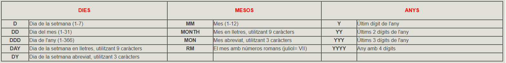
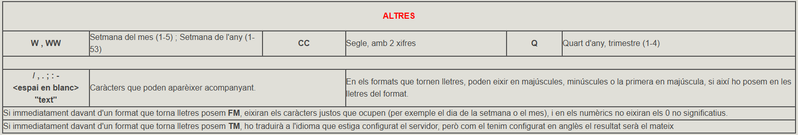

# 7\. Funcions

Com veurem un poc més avant, en les sentències SQL, a banda de columnes i
valors constants, podrem utilitzar funcions.

PostgreSQL té moltes funcions ja creades.

Farem un recull de les funcions més importants de PostgreSQL, d'entre la
multitud de funcions que existeixen. Les agruparem per categories.

Evidentment aquest recull no és per aprendre'l de memòria, sinó que servirà de
consulta.

Funcions numèriques

Funció  |  Explicació  |  Funció  |  Explicació   
---|---|---|---  
ABS(n) |  Valor absolut de n. |  LOG(m,n) |  Logaritme, base m, de n  
ACOS(n) |  Arccosinus de n (invers del cosinus) |  MOD(m,n) |  La resta de la divisió entre m i n  
ASIN(n) |  Arcsinus de n (invers de sinus) |  POWER(m,n) |  m elevat a n  
ATAN(n) |  Arctangent de n (invers de la tangent) |  RANDOM() |  número aleatori entre 0 i 1  
CEIL(n) |  Enter immediatament superior o igual a n |  Round(n,[m]) |  n arrodonit a m xifres decimals (per defecte 0)  
COS(n) |  Cosinus de n. |  SIN(n) |  Sinus de n  
EXP(n) |  Exponencial de n (en) |  SQRT(n) |  Arrel quadrada de n  
FLOOR(n) |  Enter immediatament inferior o igual a n |  TAN(n) |  Tangent de n  
LN(n) |  Logaritme neperià de n |  Trunc(n,[m]) |  n truncat a m xifres decimals  (per defecte 0)  
  
Per exemple, podríem simular el llançament d'un dau d'aquesta manera:
```
SELECT TRUNC(RANDOM()*6+1);
```
**<u>Funcions de caràcters</u>**

Funció  |  Explicació 
---|---
ASCII(c) |  Torna el codi ASCII corresponent al caràcter c 
REPLACE(c1,c2,c3) |  Reemplaça en **c1** cada ocurrència de **c2** per **c3**  
CHR(n) |  Torna el caràcter amb codi ASCII n. 
RPAD(c1,n[c2]) |  Torna **c1** reomplida per la dreta fins **n** caràcters amb la cadena **c2**  
CONCAT(c1,c2) |  Concatena les dues cadenes (equivalent a l'operador ||)  RTRIM(c1[,set]) |  Retalla per la dreta mentre troba la cadena set (per defecte blancs)  
INITCAP(c1) |  Torna la cadena amb la primera lletra de cada paraula en majúscules, i les altres en minúscules
STRPOS(s,s1) |  Busca la primera ocurrència de la subcadena s1 dins de la cadena s  
LENGTH(c1) |  Llargària de la cadena. Si c1 és de tipus CHAR, inclourà tots els espais en blanc del final.
SUBSTR(c1,m[,n]) |  Torna una subcadena de c1 que comença en el caràcter m i consta de n caràcters (per defecte fins el final)  
LPAD(c1,n[c2]) |  Torna c1 reomplida per l’esquerra fins n caràcters amb la cadena c2
TRANSLATE(c1,c2,c3) |  Torna c1 amb cada caràcter de c2 substituït pel corresponent (en ordre) de c3.  
LTRIM(c1[,set]) |  Retalla per l’esquerra mentre troba la cadena set (per defecte blancs)
LOWER(c1) |  Torna la cadena en minúscules  
UPPER(c1) |  Torna la cadena en majúscules  
  
Per exemple, traurem els graus de la latitud de les poblacions. Haurem
d'agafar els 2 primers caràcters (els de l'esquerra).
```
SELECT nom , latitud , SUBSTR(latitud,1,2)  
FROM POBLACIONS;
```
Açò ho podríem millorar, ja que d'aquesta manera obliguem a que siguen sempre
dos caràcters, els graus. De forma més genèrica, els graus és el que va davant
del símbol **º**. Per tant el que podem fer és buscar aquest símbol i traure
els de davant (des del primer fins a l'anterior a ell)
```
SELECT nom , latitud , SUBSTR(latitud,1,STRPOS(latitud,'º')-1)  
FROM POBLACIONS;
```
Per agafar els minuts de forma senzilla seria traure els caràcters 4t i 5è, és
a dir, 2 caràcters a partir del 4.
```
SELECT nom , latitud , SUBSTR(latitud,4,2)  
FROM POBLACIONS;
```
Però de forma més genèrica (per si no s'han posat 0 no significatius), haurem
de traure des de després del símbol **º** fins al caràctar anterior a **'**
(la cometa) que assenyala els minuts. Tenim a més la dificultat afegida que la
cometa justament és la manera d'especificar un text en SQL. Haurem de posar
dos cometes per a escapar, i com que és un text va entre cometes. Resultat: 4
cometes.
```
SELECT nom , latitud ,
SUBSTR(latitud,STRPOS(latitud,'º')+1,STRPOS(latitud,'''')-STRPOS(latitud,'º')-1)  
FROM POBLACIONS;
```
I el mateix faríem per als segons, (entre la cometa simple i la doble).

Aquesta sentència resumeix l'anterior, separant graus, minuts i segons.
```
SELECT nom, latitud,  
SUBSTR(latitud,1,STRPOS(latitud,'º')-1),  
SUBSTR(latitud,STRPOS(latitud,'º')+1,STRPOS(latitud,'''')-STRPOS(latitud,'º')-1),  
SUBSTR(latitud,STRPOS(latitud,'''')+1,STRPOS(latitud,'"')-STRPOS(latitud,'''')-1)  
FROM POBLACIONS;
```
**<u>Funcions de data</u>**

Funció |  Explicació  
---|---  
NOW() (CURRENT_TIMESTAMP) |  Torna la data-hora actual, amb la diferència d'hores respecte la GMT |  Totes les funcions que tornen hores (amb data o sense), ho faran fins la micra de segon, a no ser que entre parèntesi indiquem les xifres decimals (de segon) que volem  
LOCALTIMESTAMP |  Igual que l'anterior, però sense la diferència de la GMT  
CURRENT_DATE |  Torna la data actual  
CURRENT_TIME |  Torna l'hora actual (amb diferència GMT)  
LOCALTIME |  Torna l'hora actual (sense diferència GMT)  
AGE(t) |  Torna la diferència de la data actual i t  
AGE(t1,t2) |  Torna la diferència entre t1 (posterior) i t2 (anterior)  
EXTRACT(camp FROM t) |  Trau el número corresponent al camp (que pot ser year, month, day, hour, minute, second, millisecond, microsecond, dow (day of week), ...  
  
Per exemple, ¿quan de temps ha passat des de l'intent de cop d'estat?
```
SELECT AGE('1981/02/23'::DATE);
```
O un altre, ¿en quin any estem?
```
SELECT EXTRACT(year FROM CURRENT_DATE);
```
**<u>Funcions geomètriques</u>**

Funció |  Explicació |  Funció |  Explicació  
---|---|---|---  
AREA(o) |  Àrea de l'objecte |  HEIGTH(r) |  Altura del rectàngle  
CENTER(o) |  Centre de l'objecte |  RADIUS(c) |  Radi del cercle  
DIAMETER(c) |  Diàmetre del cercle |  WIDTH(r) |  Amplària del rectàngle  
  
Per exemple, l'àrea d'un cercle:
```
SELECT AREA('((5,5),2)'::CIRCLE);
```
**<u>Funcions IP</u>**

Funció |  Explicació |  Exemple |  Resultat  
---|---|---|---  
HOST(ip) |  Trau en format text l'adreça IP |  HOST('192.168.2.15/24') |  192.168.2.15  
MASKLEN(ip) |  Trau el número de bits de la màscara |  MASKLEN('192.168.2.15/24') |  24  
SET_MASKLEN(ip,n) |  Posa el número de bits de la màscara als especificats |  SET_MASKLEN('192.168.2.15/24',16) |  192.168.2.15/16  
NETMASK(ip) |  Construeix la màscara de xarxa |  NETMASK('192.168.2.15/24') |  255.255.255.0  
  
**<u>Funcions de conversió</u>**

Serviran per a passar d'un tipus a un altre, on un d'ells serà el tipus de
cadena (VARCHAR)

Funció |  Explicació  
---|---  
**TO_CHAR(_data, format_)** |  Converteix una data en una tira de caràcters, utilitzant el format especificat (es veurà aquest format en la següent pregunta)  
**TO_CHAR(_número, format_)** |  Converteix un número en una tira de caràcters  
**TO_NUMBER(_exp., format_)** |  Converteix una tira de caràcters en un número, suposant que estava en el format indicat  
**TO_DATE(_exp., format_)** |  Converteix una tira de caràcters en un data  
**TO_DATETIME(_exp., format_)** |  converteix una tira de caràcters en un data-hora  
  
## 7.1 Formats de les dates

Aquest tipus és molt versàtil en quant al format, bé siga per a la introducció
de les dades, o el que és més habitual, per a la seua presentació. S'haurà
d'utilitzar una funció, **TO_CHAR** , que acceptarà 2 paràmetres: el primer la
data que es vol presentar, i el segon el format que volem. En el format
indicarem per mig de determinats caràcters l'aspecte que volem. Per exemple,
per a traure la data d'avui amb el format dia-mes-any, posaríem:
```
SELECT TO_CHAR( NOW(), 'DD-MM-YYYY');
```
El següent quadre resumeix aquestos caràcters, agrupat per categories:




En principi els formats que tornen lletres ho estaran en anglès, però després
veurem com canviar d'idioma.



  

  
<u>Exemples:</u>

Si ara fóra **9/1/16 13:39** (en el servidor, no en la vostra màquina), i
férem **SELECT TO_CHAR(NOW(),'_format_****');**

Format |  Eixida  
---|---  
dd-mm-yy hh:mi | **09-01-23 01:39**  
dd-mm-yy hh24:mi | **09-01-16 13:39**  
dd-MON-yyy | **09-JAN-023**  
dd-TMMON-yyy | **09-ENE-023 _(si el tinguérem configurat en espanyol)_**  
Day, dd "de" month "de" yyyy | **Monday , 09 de january de 2023 de 2016**  
FMDay, dd "de" FMmonth "de" yyyy. | **Monday, 09 de january de 2023.**  
TMDay, dd "de" TMmonth "de" yyyy. | **Lunes, 09 de enero de 2023.**_(si el tinguérem configurat en espanyol)_  
FMDy PM FMhh-FMmi-FMss | **Mon PM 1-39-00**  
TMDy PM TMhh-TMmi-TMss | **Lun PM 01-39-00 __**_(si el tinguérem configurat en espanyol)_  

## 7.2 Formats dels números


També podrem utilitzar la funció **TO_CHAR** per a donar l'aspecte que vulguem
als números. En la següent taula tenim un resum amb els diferents símbols, un
comentari descriptiu de cada símbol, i un exemple de format amb el resultat
que donaria per a un determinat valor. La sentència seria **SELECT
TO_CHAR(**_valor_**,'**_format_**');** :


Llicenciat sota la  [Llicència Creative Commons Reconeixement NoComercial
CompartirIgual 3.0](http://creativecommons.org/licenses/by-nc-sa/3.0/)

